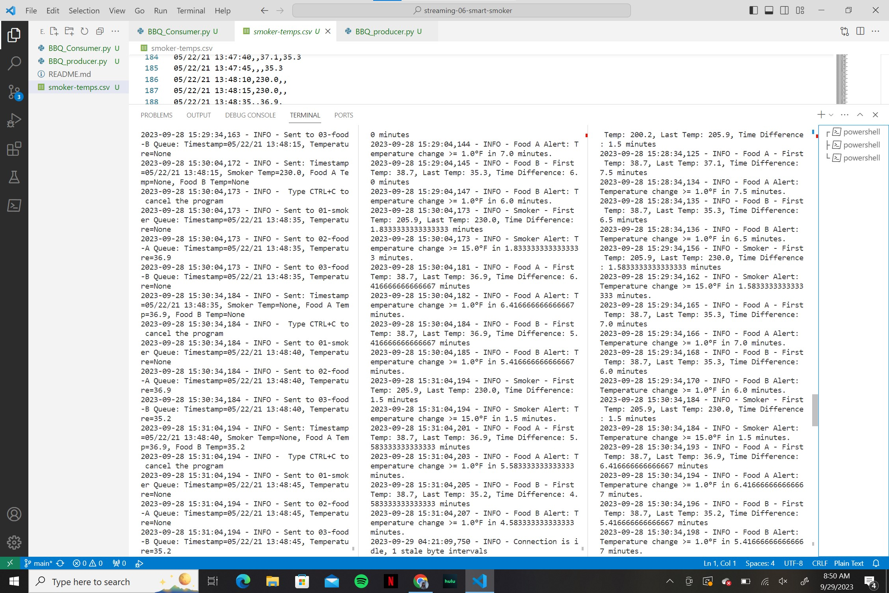
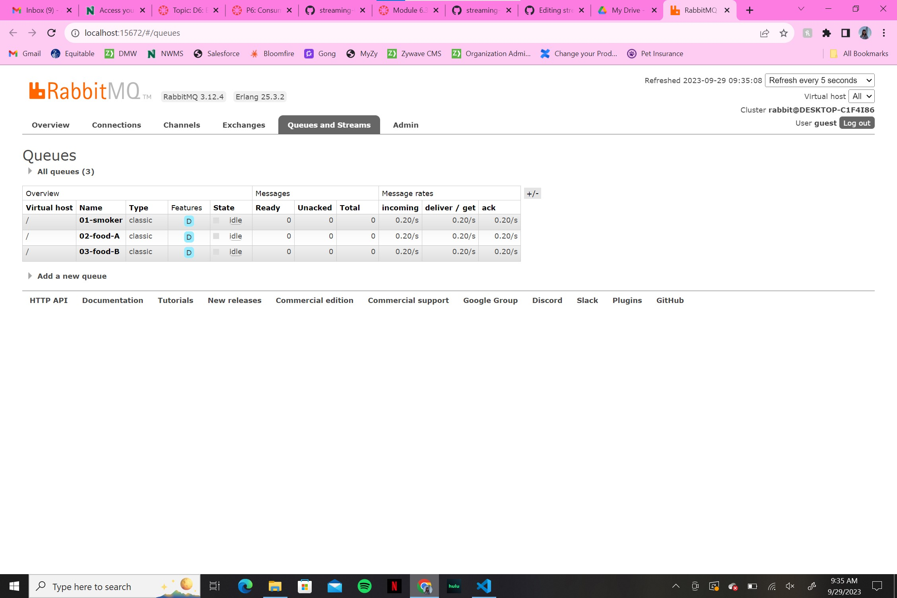

# streaming-06-smart-smoker
> Use RabbitMQ to distribute temperature readings to different worker channels and have those worker channels alert the user when certain criteria is met. 

## Pre-requisites
Make sure the following are installed on your system:
1. pika
1. sys
1. webbrowser
1. time
1. logging
1. datetime

## Before You Begin
Make sure you are in your conda environment. Ensure pika is installed and updated with the following code: 

        conda install -c conda-forge pika

## Producer Notes/Comments
This project was built after v3_listener_of_tasks.py from module 4. A copy was made and adjusted to meet the needs of the problem on hand. 

After listing imports and main variables, the individual programs were defined. 

1. "def process_temperature" was used to hold the bulk of the alerting. In this function, each temperature value is read and processed to determine the change in temperature. This is done to help build the following alerts:
    1. The smoker temperature decreases by more than 15 degrees F in 2.5 minutes (smoker alert!)
    1. Any food temperature changes less than 1 degree F in 10 minutes (food stall!)
1. "def get_time_window" is used to define the different temperature windows for each reading type. The temperature windows are as follows:
    1. Smoker time window is 2.5 minutes
    1. Food time window is 10 minutes
1. "def smoker_callback", def food_a_callback, def food_b_callback" are all used to declare the message that will be sent to the user when each type of reading is processed.
1. "def main()" is used to bring all the defined programs under one main function.

The python idiom was then used to ensure the functions were only called if this is actually the program being executed. In this case, the function being called was:
1. main()

Due to the 30 second time limit between readings, a user may hit CTRL-C to cancel the program at anytime. 

The picture below will show what an active terminal will look like when this program is running in conjuction with the BBQ_producer program. Looking closely, you'll see examples of both a typical reading and one where the alert was triggered:

The picture below will show what the RabbitMQ admin site will look like when this program is running. Something that stood out was the length of time each channel was in idle. At first I was worried my program wasn't working, but then I remembered the 30 second time interval between temperature readings:

